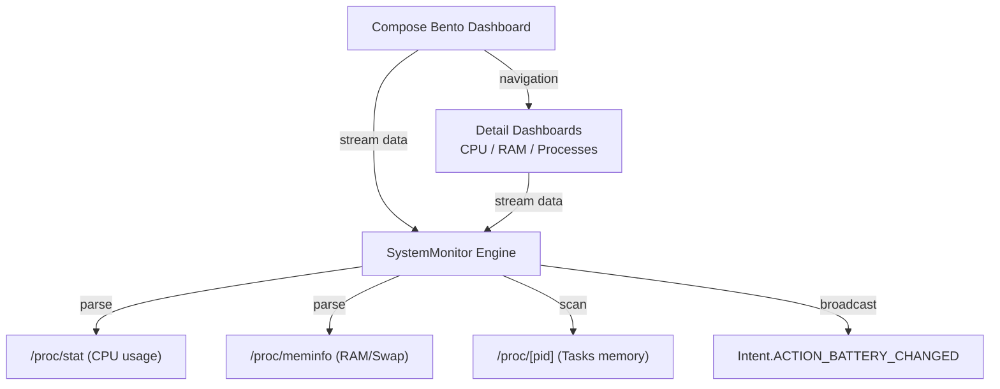

# Osyster - Developer Documentation

> Architecture, codebase structure, native statistics parsers, and verification guidance for Osyster development.

**Version:** 0.0.1 | **Last Updated:** 2026-07-06  
**Scope:** Internal development, system diagnostics, bento-grid UI paradigms, and build engineering.

---

## Table of Contents

- [Architecture Overview](#architecture-overview)
- [Project Structure](#project-structure)
- [Runtime & Diagnostics Flow](#runtime--diagnostics-flow)
- [Diagnostics Logic & Kernel Parsers](#diagnostics-logic--kernel-parsers)
- [Bento Grid Design System](#bento-grid-design-system)
- [Build Type Configurations & Package Names](#build-type-configurations--package-names)
- [Verification Guide](#verification-guide)

---

## Architecture Overview

Osyster is built around a lightweight MVVM architecture utilizing native Kotlin Flow streams for diagnostic telemetry and Jetpack Compose for the presentation layer.



---

## Project Structure

```text
osyster/
├── osyster-app/
│   ├── app/
│   │   ├── src/main/
│   │   │   ├── AndroidManifest.xml              # Main app manifest (declares MainActivity launcher)
│   │   │   ├── java/dev/qtremors/osyster/
│   │   │   │   ├── MainActivity.kt              # App shell navigation and bottom NavigationBar
│   │   │   │   ├── monitor/
│   │   │   │   │   └── SystemMonitor.kt         # Real-time statistics collectors and proc parsers
│   │   │   │   └── ui/
│   │   │   │       ├── BentoDashboard.kt        # Interactive Bento Grid home screen layout
│   │   │   │       ├── CpuDashboard.kt          # CPU gauges, core list, and Sparkline graph
│   │   │   │       ├── MemoryDashboard.kt       # RAM & Swap allocation gauges and specification rows
│   │   │   │       ├── ProcessDashboard.kt      # Task list, search, details overlay, and SIGKILL trigger
│   │   │   │       ├── DeviceInfoDashboard.kt   # System hardware details & battery specifications
│   │   │   │       └── theme/
│   │   │   │           ├── Color.kt             # Dark/light theme color tokens
│   │   │   │           ├── Theme.kt             # Theme configuration wrapper
│   │   │   │           └── VariableFontFactory.kt # Variable font factory settings
│   │   │   └── res/
│   │   │       ├── font/
│   │   │       │   └── google_sans_flex_variable.ttf # Google Sans Flex variable font
│   │   │       └── values/
│   │   │           └── themes.xml               # NoActionBar window chrome setup
│   │   └── build.gradle.kts                     # App-level build configurations (defines package suffixes)
│   ├── gradle/
│   │   └── libs.versions.toml                   # Gradle dependency catalog declarations
│   ├── build.gradle.kts                         # Root-level build configuration plugin registration
│   └── settings.gradle.kts                      # Project settings definition
├── CHANGELOG.md                                 # Stable release logs
├── DEVELOPMENT.md                               # Developer documentation (This Document)
└── README.md                                    # Main entry point overview
```

---

## Runtime & Diagnostics Flow

1. **Splash Window & Chrome Config:** The theme registers a translucent NoActionBar background. The system status bar adapts directly to dark/light canvas backgrounds.
2. **Main Navigation Host:** `MainActivity` initializes a `rememberNavController()` and builds the bottom `NavigationBar` navigation layouts, directing users by default to the Bento Grid.
3. **Bento Grid Dashboard:** `BentoDashboard` runs four coroutine collection jobs fetching live system metrics via Kotlin Flows:
   - `SystemMonitor.streamCpu()` polls processor states at 1000ms intervals.
   - `SystemMonitor.streamMemory()` polls memory statistics at 1000ms intervals.
   - `SystemMonitor.streamBattery()` tracks battery properties at 3000ms intervals.
   - A polling loop updates active background process counts every 4000ms.
4. **Bento Handoffs:** Tapping a bento card launches a clean transition page to the focused CPU, RAM, Processes, or Device Info screens.

---

## Diagnostics Logic & Kernel Parsers

Diagnostic telemetry is parsed directly from the Android Linux kernel interface:

### 1. CPU Engine Statistics
- **Overall & Per-Core Load:** Read from `/proc/stat`. The parser reads the `cpu` line (overall) and `cpu[0-9]+` lines (per core). It computes active vs. total delta jiffies over polling intervals:
  $$\text{Active Time} = \text{user} + \text{nice} + \text{system} + \text{irq} + \text{softirq}$$
  $$\text{Total Time} = \text{Active Time} + \text{idle} + \text{iowait}$$
  $$\text{CPU Usage \%} = \frac{\Delta \text{Active Time}}{\Delta \text{Total Time}} \times 100$$
- **Core Frequencies:** Read from `/sys/devices/system/cpu/cpu[id]/cpufreq/scaling_cur_freq`.
- **CPU Temperatures:** Scans common thermal path zones such as `/sys/class/thermal/thermal_zone0/temp` and parses millidegree values.

### 2. Memory allocations
- **RAM & SWAP parameters:** Parsed from `/proc/meminfo` by reading `MemTotal`, `MemFree`, `MemAvailable` (or fallback sum estimation), `Cached`, `Buffers`, `SwapTotal`, and `SwapFree`.

### 3. Active Processes List
- **Process Scan:** Iterates over the `/proc/` directory to scan numerical sub-directories (PIDs). For each PID:
  - Command names are parsed from `/proc/[pid]/cmdline` (replacing null-terminator bytes) or falls back to `/proc/[pid]/stat` text inside parentheses.
  - Memory consumption (Resident Set Size - RSS) is parsed from columns inside `/proc/[pid]/statm` and converted to Kilobytes.
- **Process Termination:** Invokes a shell executor command `kill -9 [pid]` via JVM Runtime. Graceful exceptions are caught and reported as snackbars if system permissions restrict access.

---

## Bento Grid Design System

The home layout relies on Bento-style cards:
- **Circular Gauge (`OysterArcGauge`):** Implements a Canvas drawing operation utilizing a track arc and a swept active arc with `StrokeCap.Round` and radius offset metrics.
- **Gradients & Elevations:** Surfaces use `surfaceContainerHigh` colors with neon cyan outline highlights to draw focus to critical details.

---

## Build Type Configurations & Package Names

Osyster separates package names and app label identities between debug and release builds:

```kotlin
buildTypes {
    debug {
        applicationIdSuffix = ".debug"
        versionNameSuffix = "-debug"
        manifestPlaceholders["appLabel"] = "Osyster Debug"
    }
    release {
        optimization {
            enable = false
        }
        manifestPlaceholders["appLabel"] = "Osyster"
    }
}
```

- **Debug Builds:** Packaged as `dev.qtremors.osyster.debug` (labeled **Osyster Debug**).
- **Release Builds:** Packaged as `dev.qtremors.osyster` (labeled **Osyster**).

---

## Verification Guide

To verify build soundness and compile checks:

```bash
# Clean project
./gradlew clean

# Run debug build compilation
./gradlew :app:assembleDebug
```

Verify that the output APK resolves to `app/build/outputs/apk/debug/app-debug.apk` and contains the `.debug` package suffix by checking the manifest configuration.
