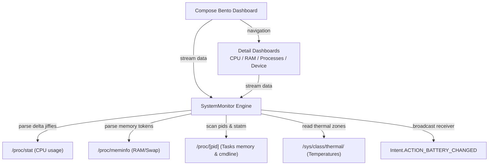

# Osyster - Developer Documentation

> Architecture, codebase structure, native statistics parsers, and verification guidance for Osyster development.

**Version:** 0.0.2 | **Last Updated:** 2026-09-04  
**Scope:** Internal development, system diagnostics, bento-grid UI paradigms, and build engineering.

---

## Table of Contents

- [Architecture Overview](#architecture-overview)
- [Technology Stack](#technology-stack)
- [Project Structure](#project-structure)
- [Runtime & Diagnostics Flow](#runtime--diagnostics-flow)
- [Diagnostics Logic & Kernel Parsers](#diagnostics-logic--kernel-parsers)
  - [CPU Engine & Delta Jiffies](#1-cpu-engine--delta-jiffies)
  - [Memory & Swap Allocations](#2-memory--swap-allocations)
  - [Active Tasks & Process Manager](#3-active-tasks--process-manager)
  - [Hardware & Battery Diagnostics](#4-hardware--battery-diagnostics)
- [Bento Grid Design System](#bento-grid-design-system)
- [Build Configurations & Package Names](#build-configurations--package-names)
- [Security & Privacy Practices](#security--privacy-practices)
- [Verification Guide](#verification-guide)
- [Maintenance & Conventions](#maintenance--conventions)

---

## Architecture Overview

Osyster is built around a lightweight MVVM architecture utilizing native Kotlin Flow streams for diagnostic telemetry and Jetpack Compose for the presentation layer. It accesses standard Linux `/proc` pseudo-filesystems and Android broadcast receivers directly on-device without requiring intermediate background daemons or external network calls.



### Key Architectural Decisions

| Decision | Rationale |
|---|---|
| **Rootless Diagnostics** | Reads core processor, memory, device specifications, and battery metrics through standard Linux `/proc` and Android APIs accessible without root privileges. |
| **Kotlin Flow Pipelines** | Emits real-time diagnostic snapshots across coroutine channels, allowing UI components to subscribe during active lifecycle states and automatically cancel when inactive. |
| **Custom Canvas Rendering** | Custom gauges (`OysterArcGauge`) and sparkline history paths are rendered directly on Hardware Canvas layers rather than heavyweight third-party charting libraries. |
| **Zero-Network Architecture** | Manifest omits `android.permission.INTERNET`, providing hardware-enforced guarantees that no metrics can leave the device. |
| **Package Separation** | Debug builds append `.debug` to applicationId and versionName, enabling side-by-side installation with release builds. |

---

## Technology Stack

| Area | Technology |
|---|---|
| Language and toolchain | Kotlin 2.2.10, Coroutines, Flow, JVM 11 bytecode target, Android Gradle Plugin 9.3.2 |
| Android platform | compileSdk 37, targetSdk 37, minSdk 24 (Android 7.0+) |
| UI Framework | Jetpack Compose BOM 2026.05.00, Material 3 1.5.0-alpha19 |
| Navigation | Navigation Compose 2.8.9 |
| State and telemetry | Native Kotlin Flow, StateFlow, Coroutines Dispatchers.IO |
| System interface | Linux `/proc` and `/sys` virtual filesystems, Android Intent broadcasts |
| Unit and UI tests | JUnit 4, AndroidX Test, Espresso Core, Compose UI Test |

---

## Project Structure

```text
osyster/
├── assets/
│   └── Osyster.png                              # High-resolution project identity emblem
├── docs/                                        # Project documentation website
│   ├── assets/
│   │   ├── Osyster.png                          # Web emblem asset
│   │   └── Tremors.jpg                          # Developer avatar
│   ├── index.html                               # Landing page (Slate Tech bento design)
│   ├── scripts.js                               # Real-time stats & interactive canvas preview
│   └── styles.css                               # Custom bento card styling and glow effects
├── osyster-app/
│   ├── app/
│   │   ├── src/main/
│   │   │   ├── AndroidManifest.xml              # App manifest (MainActivity launcher registration)
│   │   │   ├── java/dev/qtremors/osyster/
│   │   │   │   ├── MainActivity.kt              # App shell navigation and bottom NavigationBar
│   │   │   │   ├── monitor/
│   │   │   │   │   └── SystemMonitor.kt         # Real-time statistics collectors and proc parsers
│   │   │   │   └── ui/
│   │   │   │       ├── BentoDashboard.kt        # Interactive Bento Grid home screen layout
│   │   │   │       ├── CpuDashboard.kt          # CPU gauges, core list, and Sparkline graph
│   │   │   │       ├── MemoryDashboard.kt       # RAM & Swap allocation gauges and specification rows
│   │   │   │       ├── ProcessDashboard.kt      # Task list, search, details overlay, and SIGKILL trigger
│   │   │   │       ├── DeviceInfoDashboard.kt   # System hardware details & battery specifications
│   │   │   │       └── theme/
│   │   │   │           ├── Color.kt             # Dark/light theme color tokens
│   │   │   │           ├── Theme.kt             # Theme configuration wrapper
│   │   │   │           └── VariableFontFactory.kt # Variable font factory settings
│   │   │   └── res/
│   │   │       ├── font/
│   │   │       │   └── google_sans_flex_variable.ttf # Google Sans Flex variable font
│   │   │       └── values/
│   │   │           └── themes.xml               # NoActionBar window chrome setup
│   │   └── build.gradle.kts                     # App-level build configurations (defines package suffixes)
│   ├── gradle/
│   │   └── libs.versions.toml                   # Centralized dependency catalog declarations
│   ├── build.gradle.kts                         # Root-level build configuration plugin registration
│   └── settings.gradle.kts                      # Project settings definition
├── CHANGELOG.md                                 # Stable release logs
├── DEVELOPMENT.md                               # Developer documentation (This Document)
├── LICENSE.md                                   # Tremors Source License (TSL)
├── PRIVACY.md                                   # Privacy policy (Offline by design)
├── README.md                                    # Main entry point overview
└── TASKS.md                                     # Task tracking and feature roadmap
```

---

## Runtime & Diagnostics Flow

1. **Splash Window & Window Insets:** The theme registers a translucent NoActionBar background. The system status bar adapts directly to dark/light canvas backgrounds with edge-to-edge drawing.
2. **Main Navigation Host:** `MainActivity` initializes a `rememberNavController()` and builds bottom navigation layouts, directing users by default to the Bento Grid.
3. **Bento Grid Dashboard:** `BentoDashboard` runs four coroutine collection jobs fetching live system metrics via Kotlin Flows:
   - `SystemMonitor.streamCpu()` polls processor states at 1000ms intervals.
   - `SystemMonitor.streamMemory()` polls memory statistics at 1000ms intervals.
   - `SystemMonitor.streamBattery()` tracks battery properties at 3000ms intervals.
   - Background polling updates active task counts every 4000ms.
4. **Bento Transitions:** Tapping a bento card launches a clean transition page to the focused CPU, RAM, Processes, or Device Info screens.

---

## Diagnostics Logic & Kernel Parsers

Diagnostic telemetry is parsed directly from the Android Linux kernel interface:

### 1. CPU Engine & Delta Jiffies

- **Overall & Per-Core Load:** Read from `/proc/stat`. The parser reads the aggregate `cpu` line and individual `cpu[0-9]+` lines. It computes active versus total delta jiffies over successive polling intervals:
  $$\text{Active Time} = \text{user} + \text{nice} + \text{system} + \text{irq} + \text{softirq}$$
  $$\text{Total Time} = \text{Active Time} + \text{idle} + \text{iowait}$$
  $$\text{CPU Usage \%} = \frac{\Delta \text{Active Time}}{\Delta \text{Total Time}} \times 100$$
- **Core Frequencies:** Read from `/sys/devices/system/cpu/cpu[id]/cpufreq/scaling_cur_freq` (or fallback `/sys/devices/system/cpu/cpu[id]/cpufreq/cpuinfo_cur_freq`).
- **CPU Temperatures:** Scans common thermal zone paths such as `/sys/class/thermal/thermal_zone0/temp` through `thermal_zone20/temp` and parses millidegree values.

### 2. Memory & Swap Allocations

Parsed directly from `/proc/meminfo` by extracting key memory metrics:
- `MemTotal`: Total physical RAM capacity.
- `MemFree`: Physical RAM completely unallocated.
- `MemAvailable`: Estimated memory available for starting new applications without swapping.
- `Cached`: In-memory page cache for disk blocks.
- `Buffers`: In-memory temporary block storage.
- `SwapTotal`: Total configured swap/zram space.
- `SwapFree`: Remaining unused swap capacity.

### 3. Active Tasks & Process Manager

- **Process Discovery:** Iterates over the `/proc/` directory to discover numerical PID directories. For each PID:
  - Command names are parsed from `/proc/[pid]/cmdline` (replacing null-terminator bytes) or falls back to `/proc/[pid]/stat` text inside parentheses.
  - Resident Set Size (RSS) memory consumption is parsed from columns inside `/proc/[pid]/statm` and converted to Kilobytes.
- **Process Termination:** Invokes a shell executor command `kill -9 [pid]` via JVM Runtime. Exceptions are handled gracefully and reported via snackbars if system permissions restrict access.

### 4. Hardware & Battery Diagnostics

- **Hardware Specifications:** Inspects `android.os.Build` fields including `MANUFACTURER`, `MODEL`, `BOARD`, `HARDWARE`, `SUPPORTED_ABIS`, and `VERSION.SDK_INT`.
- **Battery Telemetry:** Receives sticky intents from `Intent.ACTION_BATTERY_CHANGED` to extract voltage, battery level percentage, temperature in tenths of a degree Celsius, health status, and plugged power source.

---

## Bento Grid Design System

Osyster implements a customized Bento Grid system built around the **Oyster Slate Tech** palette:

### Color Tokens

- **Slate Navy Background:** `BackgroundDark = Color(0xFF0C1115)`
- **Surface Elevation:** `SurfaceDark = Color(0xFF141C22)`
- **Card Container:** `SurfaceContainerHighDark = Color(0xFF1C2730)`
- **Electric Cyan Neon:** `PrimaryDark = Color(0xFF00E6FF)` (used for primary gauges, active sparks, and telemetry highlights)
- **Warm Amber:** `SecondaryDark = Color(0xFFFFB300)` (used for warning thresholds, battery charging, and memory distributions)
- **Coral Rose:** `TertiaryDark = Color(0xFFFF5252)` (used for critical thermal alerts and high-load states)

### Custom Canvas Components

- **Circular Arc Gauge (`OysterArcGauge`):** Custom canvas drawing operation utilizing a track arc and a swept active arc with `StrokeCap.Round` and radius offset metrics.
- **Sparkline Graph:** Plots recent processor load history across time using cubic bezier curves with gradient vertical fills.

---

## Build Configurations & Package Names

Osyster separates package identities and app labels between debug and release builds:

```kotlin
buildTypes {
    debug {
        applicationIdSuffix = ".debug"
        versionNameSuffix = "-debug"
        manifestPlaceholders["appLabel"] = "Osyster Debug"
    }
    release {
        optimization {
            enable = false
        }
        manifestPlaceholders["appLabel"] = "Osyster"
    }
}
```

- **Debug Builds:** Packaged as `dev.qtremors.osyster.debug` (labeled **Osyster Debug**).
- **Release Builds:** Packaged as `dev.qtremors.osyster` (labeled **Osyster**).

---

## Security & Privacy Practices

1. **No Network Access:** Osyster declares no internet permissions. It is architecturally impossible for metrics to be transmitted off the device.
2. **Volatile In-Memory Processing:** Telemetry snapshots exist only in volatile RAM while the corresponding screen is active.
3. **No Background Spying:** Diagnostic polling coroutines are scoped to the active composable lifecycle and are cancelled automatically when navigating away or backgrounding the application.

---

## Verification Guide

To verify build soundness and compile checks:

```bash
# Clean project
./gradlew clean

# Run debug build compilation
./gradlew :app:assembleDebug

# Run unit tests
./gradlew test
```

Verify that the output APK resolves to `app/build/outputs/apk/debug/app-debug.apk` and contains the `.debug` package suffix by checking the manifest configuration.

---

## Maintenance & Conventions

- **Changelog Updates:** Update `CHANGELOG.md` for every user-visible change. Keep entries concise, user-facing, and version-specific.
- **No Em Dashes:** Do not use em dashes anywhere in documentation or code comments. Use colons or hyphens instead.
- **Version Bumps:** Do not bump versions unless explicitly instructed.
- **Commit Formatting:** Use Title Case summaries prefixed by version tag: `vX.Y.Z: <Title Case summary>`.
