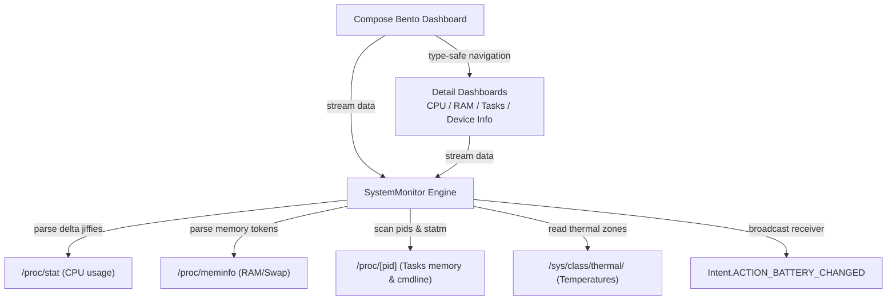

# Osyster - Developer Documentation

> Architecture, codebase structure, native statistics parsers, design tokens, and verification guidance for Osyster development.

**Version:** 0.0.3 | **Last Updated:** 2026-09-04
**Scope:** Internal development, system diagnostics, bento-grid UI paradigms, testing, and release maintenance.

---

## Table of Contents

- [Architecture Overview](#architecture-overview)
- [Technology Stack](#technology-stack)
- [Project Structure](#project-structure)
- [Runtime Flow](#runtime-flow)
- [Core Concepts](#core-concepts)
- [Navigation & State](#navigation--state)
- [Diagnostics & Telemetry Operations](#diagnostics--telemetry-operations)
- [CPU & Delta Jiffies Engine](#cpu--delta-jiffies-engine)
- [Memory & Swap Allocation System](#memory--swap-allocation-system)
- [Process & Task Management System](#process--task-management-system)
- [Hardware & Battery Diagnostics](#hardware--battery-diagnostics)
- [Thermal Zones & Frequency Scaling](#thermal-zones--frequency-scaling)
- [OS Utilities System](#os-utilities-system)
- [UI & Design System](#ui--design-system)
- [Feature Modules Deep Dive](#feature-modules-deep-dive)
- [Naming Conventions](#naming-conventions)
- [Configuration](#configuration)
- [Security & Privacy Practices](#security--privacy-practices)
- [Error Handling](#error-handling)
- [Testing Suite](#testing-suite)
- [Build & Release Engineering](#build--release-engineering)
- [Intended Changes & Anomalies](#intended-changes--anomalies)
- [Project Auditing & Quality Standards](#project-auditing--quality-standards)
- [Troubleshooting](#troubleshooting)
- [Maintenance Notes](#maintenance-notes)
- [Feedback](#feedback)

---

## Architecture Overview

Osyster is built around a reactive MVVM architecture utilizing native Kotlin Flow streams for diagnostic telemetry and Jetpack Compose for the presentation layer. It accesses standard Linux `/proc` and `/sys` pseudo-filesystems and Android broadcast receivers directly on-device without intermediate background daemons or external network calls.



### Key Architectural Decisions

| Decision | Rationale |
|---|---|
| **Rootless Diagnostics** | Reads core processor, memory, device specifications, and battery metrics through standard Linux `/proc` and Android APIs accessible without root privileges. |
| **Kotlin Flow Pipelines** | Emits real-time diagnostic snapshots across coroutine channels, allowing UI components to subscribe during active lifecycle states and automatically cancel when inactive. |
| **Type-Safe Route Serialization** | Navigation destinations are modeled as `@Serializable` data objects via `kotlinx.serialization`, preventing route typos and enabling compile-time destination checks. |
| **Custom Canvas Rendering** | Custom gauges (`OysterArcGauge`) and sparkline history paths are rendered directly on Hardware Canvas layers rather than heavyweight third-party charting libraries. |
| **Zero-Network Architecture** | Manifest omits `android.permission.INTERNET`, providing hardware-enforced guarantees that no metrics can leave the device. |
| **Package Separation** | Debug builds append `.debug` to applicationId and versionName, enabling side-by-side installation with release builds. |

---

## Technology Stack

| Area | Technology |
|---|---|
| Language and toolchain | Kotlin 2.4.10, Coroutines 1.11.0, Flow, JVM 11 target, AGP 9.3.2, Gradle 9.5.0, Foojay JDK 21 daemon |
| Android platform | compileSdk 37, targetSdk 37, minSdk 24 (Android 7.0+) |
| UI Framework | Jetpack Compose BOM 2026.08.00, Material 3 1.5.0-alpha26 (Expressive), MaterialKolor 5.0.0, Graphics Shapes 1.1.0 |
| Navigation | Navigation Compose 2.9.8, Kotlinx Serialization 1.11.0, Material 3 Adaptive Navigation 1.3.0 |
| State and telemetry | Native Kotlin Flow, StateFlow, Coroutines Dispatchers.IO |
| System interface | Linux `/proc` and `/sys` virtual filesystems, Android Intent broadcasts |
| Unit and UI tests | JUnit 4, AndroidX Test, Espresso Core, Compose UI Test |

Versions are centralized in `osyster-app/gradle/libs.versions.toml`. All Compose and Material 3 components align with the 2026.08.00 BOM line.

---

## Project Structure

```text
osyster/
├── assets/
│   └── Osyster.png                              # High-resolution project identity emblem
├── docs/                                        # Project documentation website
│   ├── assets/
│   │   ├── Osyster.png                          # Web emblem asset
│   │   └── Tremors.jpg                          # Developer avatar
│   ├── index.html                               # Landing page (Slate Tech bento design)
│   ├── scripts.js                               # Real-time stats & interactive canvas preview
│   └── styles.css                               # Custom bento card styling and glow effects
├── osyster-app/
│   ├── app/
│   │   ├── src/main/
│   │   │   ├── AndroidManifest.xml              # App manifest (MainActivity, predictive back)
│   │   │   ├── java/dev/qtremors/osyster/
│   │   │   │   ├── MainActivity.kt              # App shell, edge-to-edge, bottom NavigationBar
│   │   │   │   ├── navigation/
│   │   │   │   │   └── AppRoutes.kt             # Serializable type-safe navigation contracts
│   │   │   │   ├── monitor/
│   │   │   │   │   └── SystemMonitor.kt         # Real-time statistics collectors and proc parsers
│   │   │   │   └── ui/
│   │   │   │       ├── BentoDashboard.kt        # Interactive Bento Grid home screen layout
│   │   │   │       ├── CpuDashboard.kt          # CPU gauges, core list, and Sparkline graph
│   │   │   │       ├── MemoryDashboard.kt       # RAM & Swap allocation gauges and specification rows
│   │   │   │       ├── ProcessDashboard.kt      # Task list, search, details overlay, and SIGKILL trigger
│   │   │   │       ├── DeviceInfoDashboard.kt   # System hardware details & battery specifications
│   │   │   │       └── theme/
│   │   │   │           ├── Color.kt             # Dark/light theme color tokens
│   │   │   │           ├── Shape.kt             # Material 3 Expressive shapes & segmented helpers
│   │   │   │           ├── Theme.kt             # Theme configuration wrapper
│   │   │   │           └── Type.kt              # System typography & semantic extension properties
│   │   │   └── res/
│   │   │       ├── values/
│   │   │       │   ├── colors.xml               # Clean theme background tokens
│   │   │       │   ├── strings.xml              # Application title resources
│   │   │       │   └── themes.xml               # NoActionBar window chrome setup
│   │   │       └── xml/
│   │   │           ├── backup_rules.xml         # Backup exclusion rules
│   │   │           └── data_extraction_rules.xml# Cloud and transfer rules
│   │   ├── proguard-rules.pro                   # R8 and kotlinx.serialization preservation rules
│   │   └── build.gradle.kts                     # App-level build configurations and packaging
│   ├── gradle/
│   │   ├── libs.versions.toml                   # Centralized dependency catalog declarations
│   │   └── gradle-daemon-jvm.properties         # Foojay JDK 21 daemon definition
│   ├── signing.properties                       # Release keystore configuration
│   ├── build.gradle.kts                         # Root-level build configuration plugin registration
│   └── settings.gradle.kts                      # Project settings and repository configuration
├── CHANGELOG.md                                 # Stable release logs
├── DEVELOPMENT.md                               # Developer documentation (This Document)
├── LICENSE.md                                   # Tremors Source License (TSL)
├── PRIVACY.md                                   # Privacy policy (Offline by design)
├── README.md                                    # Main entry point overview
└── TASKS.md                                     # Task tracking and feature roadmap
```

---

## Runtime Flow

1. **Launch & Window Insets:** `MainActivity` triggers `enableEdgeToEdge()` on creation. Window insets are applied dynamically to both top app bars and bottom navigation rails, allowing content to draw fluidly beneath translucent system bars.
2. **Predictive Back Navigation:** `android:enableOnBackInvokedCallback="true"` is declared on the application manifest, enabling smooth system back animations on Android 13 (API 33) and newer.
3. **Main Navigation Host:** `MainActivity` initializes a `rememberNavController()` and binds bottom navigation destinations using `AppRoutes` contracts.
4. **Bento Grid Dashboard:** `BentoDashboard` runs four coroutine collection jobs fetching live system metrics via Kotlin Flows:
   - `SystemMonitor.streamCpu()` polls processor states at 1000ms intervals.
   - `SystemMonitor.streamMemory()` polls memory statistics at 1000ms intervals.
   - `SystemMonitor.streamBattery()` tracks battery properties at 3000ms intervals.
   - Background polling updates active task counts every 4000ms.
5. **Dashboard Transitions:** Tapping a bento card or bottom navigation item routes the user to the focused detail dashboard (`AppRoutes.Cpu`, `AppRoutes.Memory`, `AppRoutes.Processes`, or `AppRoutes.DeviceInfo`).
6. **Volatile Memory Scoping:** When navigating away or backgrounding the application, Compose lifecycle scopes automatically cancel telemetry polling flows, ensuring zero CPU drain while idle.

---

## Core Concepts

### Virtual Filesystem Polling

Osyster interacts with the Linux kernel through procfs (`/proc`) and sysfs (`/sys`). These are virtual, memory-backed filesystems maintained dynamically by the kernel:
- **Zero Disk I/O:** Reading `/proc/stat` or `/proc/meminfo` incurs no physical flash storage wear; files are generated on-the-fly by kernel drivers during read operations.
- **Rootless Boundary:** Core system telemetry files (`/proc/stat`, `/proc/meminfo`, `/sys/class/thermal/`) are readable by non-root applications. Process inspection (`/proc/[pid]/cmdline`, `/proc/[pid]/statm`) is accessible for the app's own process and visible system daemons within Android security sandbox limits.

### Rootless Diagnostics Boundaries

Android security hardening restricts direct process table access on modern API levels. Osyster queries what procfs legally exposes to non-root users:
- `/proc/stat` remains readable across Android versions, providing global CPU jiffies.
- `/proc/meminfo` remains readable, exposing system-wide physical memory, cache, and swap statistics.
- `/sys/devices/system/cpu/` nodes expose cluster frequency scaling tables and current frequencies.
- Battery telemetry is collected via Android system broadcasts (`Intent.ACTION_BATTERY_CHANGED`) rather than restricted hardware nodes.

### Polling Cadence & Power Conservation

Polling intervals balance smoothness with battery efficiency:
- **CPU Usage:** 1000ms polling window to compute accurate delta jiffies without jitter.
- **Memory & Swap:** 1000ms intervals to reflect dynamic allocation changes.
- **Battery:** 3000ms intervals (battery state changes slowly).
- **Process Discovery:** 4000ms intervals to minimize coroutine overhead during heavy background activity.

---

## Navigation & State

Type-safe navigation is built with `kotlinx.serialization` on Jetpack Navigation Compose.

### Route Definitions (`AppRoutes.kt`)

The navigation endpoints are modeled as serializable classes/objects under the `AppRoutes` namespace:

```kotlin
package dev.qtremors.osyster.navigation

import kotlinx.serialization.Serializable

@Serializable
sealed interface AppRoutes {
    @Serializable
    data object Bento : AppRoutes

    @Serializable
    data object Cpu : AppRoutes

    @Serializable
    data object Memory : AppRoutes

    @Serializable
    data object Processes : AppRoutes

    @Serializable
    data object DeviceInfo : AppRoutes
}
```

### Navigation & Back Stack Rules

- **Destination Verification:** Navigation routes are checked at compile time using `composable<AppRoutes.X>`.
- **Selected Tab State:** The bottom navigation bar matches the current destination using `currentDestination?.hasRoute(route::class) == true`.
- **Back Stack Management:** Bottom navigation taps pop up to the start destination (`AppRoutes.Bento`) with `saveState = true` and `restoreState = true`, preventing deep stack accumulation.
- **Single Top Launching:** Transitions set `launchSingleTop = true` to prevent duplicate screen instances when tapping an active navigation item multiple times.

### Screen Transitions & Animation Rules

- **Shared Scaffold:** All screens inherit the Slate Navy background and container styling for smooth visual continuity.
- **Back Stack Order:** Transitions between dashboards unwind in order, returning to the Bento grid as the root anchor.
- **Predictive Back Navigation:** Core screens integrate with Android's progressive back gestures, scaling and translating the active layouts in response to system back swipes.

---

## Diagnostics & Telemetry Operations

`SystemMonitor` serves as the central telemetry coordinator in `monitor/SystemMonitor.kt`. It encapsulates kernel file reading, delta computation, and broadcast subscription behind clean Kotlin Flow pipelines.

### Telemetry Pipeline Architecture

1. **Dispatcher Scoping:** Kernel file I/O operations execute strictly on `Dispatchers.IO` to ensure the main UI thread is never blocked by procfs reads.
2. **Channel Buffering:** Telemetry flows emit diagnostic snapshots at configured intervals, dropping stale frames if downstream consumers fall behind.
3. **Lifecycle Scoping:** Composable screens collect telemetry using `LaunchedEffect` or `collectAsStateWithLifecycle()`, which automatically suspends or cancels polling when screens leave the foreground.

---

## CPU & Delta Jiffies Engine

The CPU engine parses processor load, active core frequencies, and thermal metrics:

### Delta Jiffies Mathematics

CPU load cannot be determined from a single reading; it requires computing the delta between two time samples from `/proc/stat`. The parser reads aggregate `cpu` and per-core `cpu0`, `cpu1`, etc.:

$$\text{Active Time} = \text{user} + \text{nice} + \text{system} + \text{irq} + \text{softirq}$$

$$\text{Total Time} = \text{Active Time} + \text{idle} + \text{iowait}$$

$$\Delta \text{Active} = \text{Active}_2 - \text{Active}_1$$

$$\Delta \text{Total} = \text{Total}_2 - \text{Total}_1$$

$$\text{CPU Usage \%} = \left( \frac{\Delta \text{Active}}{\Delta \text{Total}} \right) \times 100$$

### Sparkline Rolling Window

Historical CPU load values are maintained in a bounded rolling buffer (typically 30 samples). Each sample adds a data point to `SparklineGraph`, rendering a smooth cubic bezier curve with vertical gradient fill.

---

## Memory & Swap Allocation System

Memory metrics are parsed directly from `/proc/meminfo`:

### Metrics Extraction

| Token | Description | Usage in Osyster |
|---|---|---|
| `MemTotal` | Total physical RAM installed | Total capacity baseline |
| `MemFree` | Completely unallocated memory | Free memory indicator |
| `MemAvailable` | Estimated RAM available without swapping | True available memory gauge |
| `Buffers` | In-memory temporary block storage | OS memory breakdown |
| `Cached` | In-memory page cache for disk blocks | OS cache breakdown |
| `SwapTotal` | Total configured swap/zram space | Swap capacity baseline |
| `SwapFree` | Unused swap capacity | Swap free indicator |

### Memory Calculations & Display

- **Used RAM:** $\text{MemTotal} - \text{MemAvailable}$
- **RAM Percentage:** $(\text{Used RAM} / \text{MemTotal}) \times 100$
- **Used Swap:** $\text{SwapTotal} - \text{SwapFree}$
- **Units:** Values are formatted using standard binary gigabyte (`GiB`) and megabyte (`MiB`) prefixes with 2-decimal precision.

---

## Process & Task Management System

The process engine discovers active tasks, parses process identity, and provides task management tools:

### Discovery Pipeline

1. **PID Scanning:** Scans `/proc/` for directories with strictly numeric names.
2. **Command Line Resolution:** Reads `/proc/[pid]/cmdline`, replacing null bytes (`\0`) with spaces. If empty (kernel thread or permission restricted), it parses the process name from parentheses in `/proc/[pid]/stat`.
3. **Memory Footprint (RSS):** Reads the second column of `/proc/[pid]/statm`, representing Resident Set Size pages, and multiplies by memory page size (typically 4KB) to compute RSS in Kilobytes.

### Task Termination & Security

- **Trigger:** Invokes `kill -9 [pid]` via JVM Runtime.
- **Safety Dialogs:** Requires explicit user confirmation before executing SIGKILL.
- **Permission Handlers:** Protected system processes blocked by SELinux are caught gracefully, displaying a non-disruptive feedback message rather than crashing.

---

## Hardware & Battery Diagnostics

### Hardware Specifications

Hardware properties are queried from `android.os.Build`:
- `MANUFACTURER`, `MODEL`, `BRAND`, `DEVICE`
- `BOARD`, `HARDWARE`, `SOC_MANUFACTURER`
- `SUPPORTED_ABIS`, `BOOTLOADER`
- `VERSION.RELEASE`, `VERSION.SDK_INT`, `VERSION.SECURITY_PATCH`

### Battery Telemetry

Battery diagnostics subscribe to the sticky system broadcast `Intent.ACTION_BATTERY_CHANGED`:
- **Level & Scale:** Calculates battery percentage: $(\text{level} / \text{scale}) \times 100$.
- **Voltage:** Extracted in millivolts (`BatteryManager.EXTRA_VOLTAGE`).
- **Temperature:** Extracted in tenths of a degree Celsius and converted to Celsius and Fahrenheit.
- **Health:** Evaluates health constants (`HEALTH_GOOD`, `HEALTH_OVERHEAT`, `HEALTH_DEAD`, `HEALTH_OVER_VOLTAGE`).
- **Plugged Status:** Identifies power source (`AC`, `USB`, `WIRELESS`, `DOCK`, or `UNPLUGGED`).

---

## Thermal Zones & Frequency Scaling

### Thermal Zones Discovery

Osyster scans Linux thermal zones dynamically:
- Probes `/sys/class/thermal/thermal_zone0/temp` through `thermal_zone20/temp`.
- Reads millidegree Celsius integer values and converts to standard degrees.
- Associates available zones with CPU cluster names or labels them by index.

### Frequency Scaling

CPU core frequencies are read from CPU frequency scaling governors:
- Probes `/sys/devices/system/cpu/cpu[id]/cpufreq/scaling_cur_freq`.
- Falls back to `cpuinfo_cur_freq` if `scaling_cur_freq` is unreadable.
- Handles offline or sleeping CPU cores (returning 0 or inaccessible) without exceptions.

---

## OS Utilities System

Osyster provides built-in system utilities and management capabilities:

- **Rootless Operation:** All utilities operate strictly within user-space permissions.
- **Direct System Actions:** Shortcut actions to Android developer settings, battery usage details, and application storage settings.
- **Zero Background Footprint:** Utilities run on-demand without persistent foreground services or background battery drain.

---

## UI & Design System

Osyster implements a high-end, premium design system built on **Material 3 Expressive** design tokens, custom canvas physics, and the **Oyster Slate Tech** palette.

### 1. Theme & Customization Engine (`Theme.kt`, `Color.kt`)

- **Theme Modes:**
  - `DARK`: Standard slate tech theme using Dark Slate Navy (`#0C1115`) background and Surface Slate (`#141C22`).
  - `OLED`: Deep pure-black container overrides for maximum battery efficiency on AMOLED panels.
- **Color Tokens:**
  - `BackgroundDark`: `#0C1115` (Deep Slate Navy)
  - `SurfaceDark`: `#141C22` (Surface Slate)
  - `SurfaceContainerHighDark`: `#1C2730` (Card Container Slate)
  - `PrimaryDark`: `#00E6FF` (Electric Cyan Neon for gauges, highlights, and active states)
  - `SecondaryDark`: `#FFB300` (Warm Amber for warnings, battery, and memory allocations)
  - `TertiaryDark`: `#FF5252` (Coral Rose for thermal limits and critical alerts)
- **Composition Locals:**
  - `LocalSpacing`: Standardized padding and margin coordinates.
  - `LocalHapticFeedback`: Respects system vibration and haptic settings.

### 2. Motion & Animation Tokens (`Motion.kt`, `AnimationTokens`)

- **Bouncy Spring Physics:** Jetpack Compose spring animations use tuned damping ratios (`dampingRatio = 0.75f`, `stiffness = Spring.StiffnessMediumLow`) for responsive, tactile card feedback.
- **Card Press Actions (`bounceClickable`):** Interactive cards scale smoothly on touch-down and touch-up with haptic response.
- **Margin & Padding Safeguards:** Dynamic padding values are clamped to non-negative coordinates (`coerceAtLeast(0.dp)`) to prevent spring overshoot layout crashes.
- **Transition States:** Predictive back navigation integrates with Android 13+ gesture handling.

### 3. Custom Layout Components

- **Bento Grid Container (`BentoDashboard`):** High-density responsive grid organizing system telemetry into compact visual modules.
- **Circular Arc Gauge (`OysterArcGauge`):** Hardware Canvas-drawn arc gauge featuring smooth track backgrounds, swept active arcs with `StrokeCap.Round`, and centered metrics.
- **Sparkline Graph (`SparklineGraph`):** Canvas-rendered historical load graph with cubic bezier smoothing and semi-transparent vertical gradient fill.
- **Glassmorphic Bottom Navigation (`NavigationBar`):** Floating bottom navigation bar styled with surface elevation and tonal tinting.

### 4. Gesture Physics & Interactive Components

- **Touch Down Scale:** Bento cards animate scale on touch down for immediate tactile feedback.
- **Debounced Search:** Process list search filters PIDs and command names with debounced text queries to prevent frame drops.
- **Confirmation Dialogs:** Destructive actions (such as process SIGKILL) require confirmation dialogs with haptic prompts.

### 5. UI/UX Rules & Guidelines for Developers

- **Real-Time Gauge Interpolation:** Animate gauge values with `animateFloatAsState` to prevent jarring metric jumps during polling updates.
- **Volatile Memory Scoping:** Coroutine polling scopes must be tied to Composable lifecycle to guarantee zero idle CPU consumption.
- **Scroll Preservation:** Retain list scroll state when navigating between detail views and the main Bento dashboard.
- **Visual Continuity:** Compose screens using `Theme.kt` surface tokens, semantic typography, and standard 24.dp bento card corner shapes.

### 6. Material 3 Expressive APIs & Typography Guidelines

- **`ExperimentalMaterial3ExpressiveApi` Coverage:** Applied across dashboards for expressive components and layout containers.
- **Semantic Typography (`Type.kt`):**
  - `Typography.titleLargeBold`: Emphasized bold title headers.
  - `Typography.filename`: `titleMedium` styling with Medium weight and zero letter spacing for filenames and process names.
  - `Typography.fileMetadata`: `bodySmall` styling with normal weight for memory, PIDs, and frequencies.
  - `Typography.pathBreadcrumb`: `labelLarge` styling with Medium weight for navigation breadcrumbs.
  - `Typography.storageMetric`: `headlineMedium` styling with SemiBold weight for telemetry percentages.
  - `Typography.sectionHeader`: `titleSmall` styling with Bold weight for section titles.
  - `Typography.dangerLabel`: `labelLarge` styling with SemiBold weight for alert notices.
  - *Weight Helpers:* `titleMediumBold`, `titleMediumSemiBold`, `titleSmallSemiBold`, `bodyLargeMedium`, `bodyMediumBold`, and `bodySmallMedium`.

---

## Feature Modules Deep Dive

### 1. Bento Dashboard (`ui/BentoDashboard.kt`)

- **Entry:** Main landing dashboard loaded as `AppRoutes.Bento`.
- **State:** Live telemetry subscriptions to `streamCpu()`, `streamMemory()`, `streamBattery()`, and task count polling.
- **Components:** High-density Bento Grid featuring interactive summary cards (CPU usage arc gauge, RAM/Swap metrics, active task counts, battery status, and device metadata).
- **Navigation:** Dispatches typed destination contracts (`AppRoutes.Cpu`, `AppRoutes.Memory`, `AppRoutes.Processes`, `AppRoutes.DeviceInfo`).

### 2. CPU Dashboard (`ui/CpuDashboard.kt`)

- **Telemetry:** Real-time overall processor usage, active core frequencies, core-by-core load breakdown, and thermal zones.
- **Visuals:** Canvas-rendered `OysterArcGauge` for aggregate CPU percentage, real-time cubic bezier `SparklineGraph` historical trend line, and per-core progress indicators.
- **Controls:** Polling interval configuration and core thermal alerts.

### 3. Memory Dashboard (`ui/MemoryDashboard.kt`)

- **Telemetry:** Total physical RAM, available RAM, used RAM, buffers, cached memory, and Swap/zram allocation parsed from `/proc/meminfo`.
- **Visuals:** Segmented memory distribution gauges, free vs available distinction, and Swap utilization percentages.
- **Specifications:** Formatted binary gigabyte representations (`GiB`) with raw kilobyte accuracy.

### 4. Process Manager (`ui/ProcessDashboard.kt`)

- **Discovery:** Scans `/proc` PID directories, extracting executable command lines and Resident Set Size (RSS) memory consumption from `/proc/[pid]/statm`.
- **Interactions:** Live debounced search filtering by process name and PID, sorted by memory footprint or PID.
- **Termination:** Direct `SIGKILL` (`kill -9`) execution via JVM Runtime with user confirmation dialogs and permission failure handling.

### 5. Device Info Dashboard (`ui/DeviceInfoDashboard.kt`)

- **Hardware Profile:** Manufacturer, model, board, hardware platform, CPU architecture, supported ABIs, and bootloader version.
- **Software Profile:** Android OS version, API level (SDK INT), build fingerprint, security patch level, and kernel version.
- **Battery Health:** Live voltage, temperature, health status, charging technology, and connected power source from sticky battery broadcasts.

---

## Naming Conventions

### Directory & File Names

- **Compose Screens & Dashboards:** PascalCase with `Dashboard` or `Screen` suffix (e.g. `CpuDashboard.kt`).
- **Composables:** PascalCase without suffix (e.g. `OysterArcGauge.kt`).
- **Telemetry Models:** PascalCase with `State` suffix (e.g. `CpuState.kt`, `MemoryState.kt`).
- **Engine Objects:** PascalCase with `Monitor` suffix (e.g. `SystemMonitor.kt`).

### Method Signatures

| Prefix | Intent | Example |
|---|---|---|
| `stream` | Continuous Kotlin Flow emission | `streamCpu(intervalMs)` |
| `get` | Instantaneous telemetry read | `getCpuState()`, `getMemoryState()` |
| `parse` | Data transformation from raw kernel files | `parseProcStat()`, `parseMeminfo()` |
| `format` | Convert data for presentation | `formatMemorySize(kb)` |
| `navigate` | Transition screens | `navController.navigate(route)` |
| `is` / `has` | Boolean state validation | `hasSigningConfig`, `swapActive` |

---

## Configuration

### Compilation Metrics

| Attribute | Configuration Value |
|---|---|
| **Namespace** | `dev.qtremors.osyster` |
| **Application ID** | `dev.qtremors.osyster` |
| **Compile SDK** | 37 |
| **Target SDK** | 37 |
| **Min SDK** | 24 (Android 7.0+) |
| **Version Code** | 3 |
| **Version Name** | 0.0.3 |
| **Java Target** | JVM 11 |
| **Gradle Version** | 9.5.0 |
| **AGP Version** | 9.3.2 |
| **Compose BOM** | 2026.08.00 |

### Manifest Declarations

```xml
<manifest xmlns:android="http://schemas.android.com/apk/res/android"
    xmlns:tools="http://schemas.android.com/tools">

    <application
        android:allowBackup="true"
        android:dataExtractionRules="@xml/data_extraction_rules"
        android:fullBackupContent="@xml/backup_rules"
        android:icon="@mipmap/ic_launcher"
        android:label="${appLabel}"
        android:roundIcon="@mipmap/ic_launcher_round"
        android:supportsRtl="true"
        android:enableOnBackInvokedCallback="true"
        tools:targetApi="tiramisu"
        android:theme="@style/Theme.Osyster">
        
        <activity
            android:name=".MainActivity"
            android:exported="true"
            android:theme="@style/Theme.Osyster">
            <intent-filter>
                <action android:name="android.intent.action.MAIN" />
                <category android:name="android.intent.category.LAUNCHER" />
            </intent-filter>
        </activity>
    </application>
</manifest>
```

*Important:* Osyster does **not** declare `android.permission.INTERNET`.

### Build Configurations & Package Names

Osyster separates package identities and app labels between debug and release builds:

```kotlin
buildTypes {
    debug {
        applicationIdSuffix = ".debug"
        versionNameSuffix = "-debug"
        manifestPlaceholders["appLabel"] = "Osyster Debug"
        enableUnitTestCoverage = true
    }
    release {
        if (hasSigningConfig) {
            signingConfig = signingConfigs.getByName("release")
        }
        isMinifyEnabled = true
        isShrinkResources = true
        manifestPlaceholders["appLabel"] = "Osyster"
        proguardFiles(
            getDefaultProguardFile("proguard-android-optimize.txt"),
            "proguard-rules.pro"
        )
    }
}
```

- **Debug Builds:** Packaged as `dev.qtremors.osyster.debug` (labeled **Osyster Debug**).
- **Release Builds:** Packaged as `dev.qtremors.osyster` (labeled **Osyster**). Artifacts are output as `Osyster-$version.apk`.

---

## Security & Privacy Practices

1. **Rootless Operation:** All telemetry reading operates strictly within user-space permissions using readable Linux procfs/sysfs nodes and Android broadcasts.
2. **Zero Network Access:** Osyster declares no internet permissions. It is architecturally impossible for metrics to be transmitted off the device.
3. **Volatile In-Memory Processing:** Telemetry snapshots exist only in volatile RAM while the corresponding screen is active.
4. **No Background Spying:** Diagnostic polling coroutines are scoped to the active composable lifecycle and are cancelled automatically when navigating away or backgrounding the application.
5. **No Third-Party Analytics:** Contains zero tracking SDKs, telemetry libraries, or crash reporting services.
6. **Direct Local SIGKILL:** Process termination executes via local JVM Runtime without intermediate cloud commands or external helpers.
7. **Read-Only Virtual Files:** Sysfs and procfs nodes are accessed with standard read-only streams.
8. **No Unnecessary Permissions:** Does not request storage management, contacts, camera, or location access.
9. **Secure Release Signing:** Keystore properties are resolved locally via `signing.properties` and are strictly excluded from source control.
10. **Predictable Back Behavior:** Full support for predictive back navigation guarantees transparent, predictable user navigation.

---

## Error Handling

- **Procfs Read Resilience:** Kernel virtual file reads catch `IOException` and fallback to safe zero or baseline values when kernel nodes are unreadable.
- **Offline Core Handling:** CPU clusters in low-power states may power down individual cores. The parser handles missing or inaccessible core frequency files gracefully by reporting offline status rather than crashing.
- **Permission Denials:** If the OS restricts task termination for system-protected processes, `SystemMonitor.killProcess` catches security exceptions and reports failure cleanly without crashing the UI.
- **Cancellation Safety:** Coroutine polling blocks catch and rethrow `CancellationException` to ensure proper coroutine channel cancellation:

```kotlin
try {
    readProcStat()
} catch (e: Exception) {
    if (e is CancellationException) throw e
    Log.w("SystemMonitor", "Failed to parse proc stats", e)
}
```

---

## Testing Suite

Osyster uses JVM unit tests, Android test runners, and automated build convention verification:

### Test Distribution

- **JVM Unit Tests:** Verify procfs string parsers, memory unit conversions, delta jiffy arithmetic, and state formatting.
- **Instrumented UI Tests:** Verify composable rendering, canvas drawing bounds, and navigation stack transitions.
- **Build Convention Checks:** Automated Gradle tasks validating version metadata and catalog consistency.

### Verification Commands

```bash
# Verify release version metadata and catalog freshness
./gradlew verifyOsysterBuildConventions

# Run JVM unit tests
./gradlew test

# Compile debug APK
./gradlew :app:assembleDebug

# Compile minified, signed release APK
./gradlew :app:assembleRelease
```

### Per-Module Test Commands

```bash
# App module unit tests
./gradlew :app:testDebugUnitTest

# App module build convention verification
./gradlew :app:verifyOsysterBuildConventions
```

---

## Build & Release Engineering

Commands are run from `osyster-app/` with JDK 21 and Android SDK 37 installed. Use `gradlew.bat` on Windows.

```bash
# Configure the project and verify the wrapper/toolchain
./gradlew help

# Generate the debug APK
./gradlew :app:assembleDebug

# Install the debug APK after a successful build
adb install -r app/build/outputs/apk/debug/Osyster-0.0.3-debug.apk

# Run app unit tests
./gradlew :app:testDebugUnitTest

# Run convention verification
./gradlew :app:verifyOsysterBuildConventions

# Generate the signed, minified release APK
./gradlew :app:assembleRelease
```

### Release Signing

Release signing reads `signing.properties`, with `local.properties` as a fallback. Never commit production keystore files or passwords.

```properties
signing.storeFile=my-release-key.jks
signing.storePassword=your_store_password
signing.keyAlias=your_key_alias
signing.keyPassword=your_key_password
```

### APK Naming Standards

- **Osyster Debug:** `app/build/outputs/apk/debug/Osyster-0.0.3-debug.apk`
- **Osyster Release:** `app/build/outputs/apk/release/Osyster-0.0.3.apk`

---

## Intended Changes & Anomalies

| Aspect | Custom Implementation | Design Rationale |
|---|---|---|
| **Rootless /proc Parsing** | Reads Linux `/proc` pseudo-files directly without root daemons. | Enables instant diagnostic insights on non-rooted production devices. |
| **Local Runtime SIGKILL** | Executes task termination directly via JVM Runtime process execution. | Provides immediate task management without external superuser managers. |
| **No Network Declaration** | Entirely omits `android.permission.INTERNET`. | Delivers hardware-level privacy guarantees for all telemetry data. |
| **Volatile State Storage** | Diagnostic snapshots are kept in volatile memory only. | Prevents unnecessary flash storage writes and battery drain. |

---

## Project Auditing & Quality Standards

When reviewing code changes, ensure:
1. **Scope Compliance:** Telemetry collectors must remain within standard Linux sysfs and procfs boundaries.
2. **Resource Efficiency:** Polling intervals must not exceed UI refresh requirements (e.g. 1000ms for CPU, 3000ms for battery).
3. **Memory Safety:** Do not cache unbounded history lists; retain fixed-size rolling buffers for sparklines.
4. **Clean Architecture:** Telemetry collection remains in `SystemMonitor.kt`; Composables handle presentation only.
5. **Zero Em Dashes:** Do not use em dashes anywhere in documentation or code comments. Use hyphens or colons instead.
6. **Hard Limits:** Production files remain at or below 500 lines, and Composables keep focused parameter counts.
7. **Type-Safe Navigation:** Always use `@Serializable` `AppRoutes` objects for navigation destinations.
8. **Platform Boundaries:** Composable functions must not inspect raw Linux `/proc` paths directly; all kernel parsing belongs in `SystemMonitor`.
9. **Volatile State:** Telemetry state must remain in memory and cancel on lifecycle pause/stop.
10. **Focused Verification:** Run unit tests and convention checks before declaring milestones.

---

## Troubleshooting

- **Inaccessible thermal zones:** Certain SoC vendors restrict thermal zones under custom sysfs paths. Osyster scans zones 0 through 20 and falls back gracefully when specific zones are restricted.
- **CPU core frequency shows 0:** When CPU cores enter deep idle sleep (C-states), scaling frequency nodes may report zero or be unreadable until the core wakes. This is normal kernel behavior.
- **Task kill fails:** Attempting to terminate system-critical processes (e.g. Zygote or system_server) without root privileges will be rejected by SELinux. Osyster catches the security denial cleanly.
- **Build toolchain errors:** Ensure Android SDK 37 is installed and Gradle daemon uses JDK 21 via the Foojay toolchain resolver.

---

## Maintenance Notes

- **Changelogs:** Update `CHANGELOG.md` for every user-visible change. Keep entries concise, user-facing, and version-specific.
- **No Em Dashes:** Do not use em dashes anywhere in documentation or code comments.
- **Version Alignment:** Do not bump versions unless explicitly instructed. On version bumps, keep project and build versions identical and derive the version code by removing dots (`1.2.3` -> `123`).
- **Commit Formatting:** Use Title Case summaries prefixed by version tag: `vX.Y.Z: <Title Case summary>`.

---

## Feedback

Osyster is a solo project by [Tremors](https://github.com/qtremors). Forking for personal use is welcome under the Tremors Source License (TSL) terms.

To report bugs, suggest features, or audit telemetry parsers, please open an issue on the [GitHub issue tracker](https://github.com/qtremors/osyster/issues).

---

<p align="center">
  <a href="README.md">Back to README</a>
</p>
