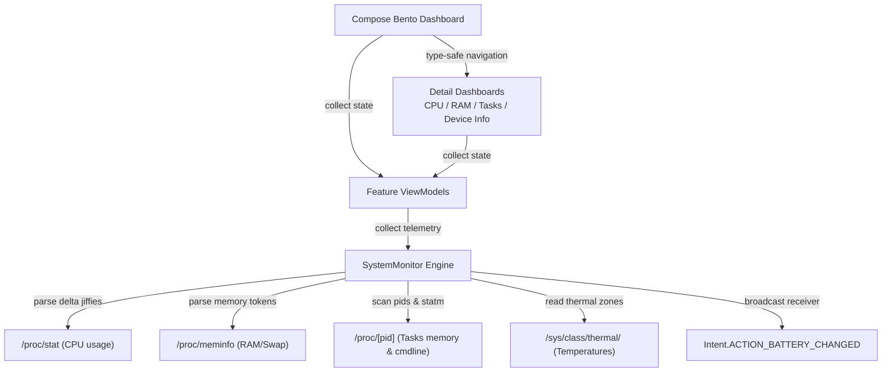

# Osyster - Developer Documentation

> Architecture, codebase structure, native statistics parsers, design tokens, and verification guidance for Osyster development.

**Version:** 0.1.0 | **Last Updated:** 2026-09-06
**Scope:** Internal development, system diagnostics, bento-grid UI paradigms, testing, and release maintenance.

---

## Table of Contents

- [Architecture Overview](#architecture-overview)
- [Technology Stack](#technology-stack)
- [Project Structure](#project-structure)
- [Runtime Flow](#runtime-flow)
- [Core Concepts](#core-concepts)
- [Navigation & State](#navigation--state)
- [Diagnostics & Telemetry Operations](#diagnostics--telemetry-operations)
- [CPU & Delta Jiffies Engine](#cpu--delta-jiffies-engine)
- [Memory & Swap Allocation System](#memory--swap-allocation-system)
- [Process & Task Management System](#process--task-management-system)
- [Hardware & Battery Diagnostics](#hardware--battery-diagnostics)
- [Thermal Zones & Frequency Scaling](#thermal-zones--frequency-scaling)
- [OS Utilities System](#os-utilities-system)
- [UI & Design System](#ui--design-system)
- [Feature Modules Deep Dive](#feature-modules-deep-dive)
- [Naming Conventions](#naming-conventions)
- [Configuration](#configuration)
- [Security & Privacy Practices](#security--privacy-practices)
- [Error Handling](#error-handling)
- [Testing Suite](#testing-suite)
- [Build & Release Engineering](#build--release-engineering)
- [Intended Changes & Anomalies](#intended-changes--anomalies)
- [Project Auditing & Quality Standards](#project-auditing--quality-standards)
- [Troubleshooting](#troubleshooting)
- [Maintenance Notes](#maintenance-notes)
- [Feedback](#feedback)

---

## Architecture Overview

Osyster is built around a reactive MVVM architecture utilizing native Kotlin Flow streams for diagnostic telemetry and Jetpack Compose for the presentation layer. It accesses standard Linux `/proc` and `/sys` pseudo-filesystems and Android broadcast receivers directly on-device without intermediate background daemons or external network calls.



### Key Architectural Decisions

| Decision | Rationale |
|---|---|
| **Rootless Diagnostics** | Reads accessible `/proc` and `/sys` files and Android APIs without root; CPU, thermal, and process visibility varies by OS and device. |
| **Kotlin Flow Pipelines** | ViewModels collect diagnostic flows and expose StateFlow to lifecycle-aware UI collectors. Producers run only while a visible, resumed screen collects their state. |
| **Type-Safe Route Serialization** | Navigation destinations are modeled as `@Serializable` data objects via `kotlinx.serialization`, preventing route typos and enabling compile-time destination checks. |
| **Custom Canvas Rendering** | `OysterArcGauge` wraps Material 3 wavy progress; sparklines and the network timeline use Canvas without a third-party charting library. |
| **Zero-Network Architecture** | Manifest omits `android.permission.INTERNET`; diagnostics are processed locally. User-invoked links and copy actions hand content to other apps or the clipboard. |
| **Package Separation** | Debug builds append `.debug` to applicationId and versionName, enabling side-by-side installation with release builds. |

---

## Technology Stack

| Area | Technology |
|---|---|
| Language and toolchain | Kotlin 2.4.10, Coroutines 1.11.0, Flow, JVM 11 target, AGP 9.3.2, Gradle 9.5.0, Foojay JDK 21 daemon |
| Android platform | compileSdk 37, targetSdk 37, minSdk 24 (Android 7.0+) |
| UI Framework | Jetpack Compose BOM 2026.08.00, Material 3 1.5.0-alpha26 (Expressive), Graphics Shapes 1.1.0 |
| Navigation | Navigation Compose 2.9.8, Kotlinx Serialization 1.11.0, Material 3 Adaptive Navigation 1.3.0 |
| State and telemetry | ViewModels, SavedStateHandle, StateFlow, SharedPreferences, Coroutines Dispatchers.IO |
| System interface | Linux `/proc` and `/sys` virtual filesystems, Android Intent broadcasts |
| Unit and UI tests | JUnit 4 and Coroutines Test; AndroidX Test, Espresso, and Compose UI Test dependencies are configured |

Versions are centralized in `osyster-app/gradle/libs.versions.toml`. Compose uses the 2026.08.00 BOM; Material 3 and Adaptive have explicit version overrides.

---

## Project Structure

```text
osyster/
├── assets/
│   └── Osyster.png                              # High-resolution project identity emblem
├── docs/                                        # Project documentation website
│   ├── assets/
│   │   ├── Osyster.png                          # Web emblem asset
│   │   └── Tremors.jpg                          # Developer avatar
│   ├── index.html                               # Landing page (Slate Tech bento design)
│   ├── scripts.js                               # Public GitHub stats & simulated canvas preview
│   └── styles.css                               # Custom bento card styling and glow effects
├── osyster-app/
│   ├── app/
│   │   ├── src/main/
│   │   │   ├── AndroidManifest.xml              # App manifest (MainActivity, predictive back)
│   │   │   ├── java/dev/qtremors/osyster/
│   │   │   │   ├── MainActivity.kt              # App shell, edge-to-edge, main pager & floating dock
│   │   │   │   ├── navigation/
│   │   │   │   │   └── AppRoutes.kt             # Serializable type-safe navigation contracts
│   │   │   │   ├── monitor/
│   │   │   │   │   ├── SystemMonitor.kt         # CPU, memory, battery, and visible processes
│   │   │   │   │   ├── NetworkMonitor.kt        # Local network history and live speeds
│   │   │   │   │   ├── AppStopperMonitor.kt     # Managed apps and system shortcuts
│   │   │   │   │   └── TelemetryResult.kt       # Available/restricted CPU and thermal values
│   │   │   │   ├── settings/
│   │   │   │   │   └── OsysterPreferences.kt    # Local preferences and managed packages
│   │   │   │   └── ui/
│   │   │   │       ├── BentoDashboard.kt        # Interactive Bento Grid home screen layout
│   │   │   │       ├── CpuDashboard.kt          # CPU gauges, core list, and Sparkline graph
│   │   │   │       ├── MemoryDashboard.kt       # RAM & Swap allocation gauges and specification rows
│   │   │   │       ├── ProcessDashboard.kt      # Visible tasks, search, details, and App Info actions
│   │   │   │       ├── DeviceInfoDashboard.kt   # System hardware details & battery specifications
│   │   │   │       ├── NetworkDashboard.kt      # Network history and per-app usage
│   │   │   │       ├── AppStopperScreen.kt      # Managed app list and picker
│   │   │   │       ├── TelemetryDashboard.kt    # CPU/RAM tab switcher
│   │   │   │       ├── viewmodel/               # Feature StateFlow and action handlers
│   │   │   │       ├── util/                    # Icon cache, insets, and haptics
│   │   │   │       ├── onboarding/              # First-run setup and permissions
│   │   │   │       ├── settings/                # Settings, About, and licenses
│   │   │   │       ├── navigation/              # Floating dock
│   │   │   │       └── theme/
│   │   │   │           ├── Color.kt             # Dark/light theme color tokens
│   │   │   │           ├── Shape.kt             # Material 3 Expressive shapes & segmented helpers
│   │   │   │           ├── Theme.kt             # Theme configuration wrapper
│   │   │   │           └── Type.kt              # System typography & semantic extension properties
│   │   │   └── res/
│   │   │       ├── values/
│   │   │       │   ├── colors.xml               # Clean theme background tokens
│   │   │       │   ├── strings.xml              # Application strings and accessibility labels
│   │   │       │   └── themes.xml               # NoActionBar window chrome setup
│   │   │       └── xml/
│   │   │           ├── backup_rules.xml         # Backup exclusion rules
│   │   │           └── data_extraction_rules.xml# Cloud and transfer rules
│   │   ├── proguard-rules.pro                   # R8 and kotlinx.serialization preservation rules
│   │   └── build.gradle.kts                     # App-level build configurations and packaging
│   ├── gradle/
│   │   ├── libs.versions.toml                   # Centralized dependency catalog declarations
│   │   └── gradle-daemon-jvm.properties         # Foojay JDK 21 daemon definition
│   ├── signing.properties                       # Optional local signing config (not tracked)
│   ├── build.gradle.kts                         # Root-level build configuration plugin registration
│   └── settings.gradle.kts                      # Project settings and repository configuration
├── CHANGELOG.md                                 # Stable release logs
├── DEVELOPMENT.md                               # Developer documentation (This Document)
├── LICENSE.md                                   # Tremors Source License (TSL)
├── PRIVACY.md                                   # Privacy policy (Offline by design)
├── README.md                                    # Main entry point overview
└── TASKS.md                                     # Task tracking and feature roadmap
```

---

## Runtime Flow

1. **Launch & Window Insets:** `MainActivity` triggers `enableEdgeToEdge()` on creation. Window insets are applied dynamically to top app bars and the floating bottom dock, allowing content to draw fluidly beneath translucent system bars.
2. **Predictive Back Navigation:** `android:enableOnBackInvokedCallback="true"` is declared on the application manifest, with Compose predictive-back handlers for supported system gestures.
3. **Main Navigation Host:** `MainActivity` initializes a `rememberNavController()` and uses `AppRoutes` for onboarding and subpages. The main dock selects Dashboard, Telemetry, or Tasks in a horizontal pager.
4. **Bento Grid Dashboard:** `BentoViewModel` collects live system metrics and exposes them to `BentoDashboard`:
   - `SystemMonitor.streamCpu()` polls processor states at the configured diagnostics interval.
   - `SystemMonitor.streamMemory()` polls memory statistics at the configured diagnostics interval.
   - `SystemMonitor.streamBattery()` tracks battery properties at 3000ms intervals.
   - Process counts refresh at twice the diagnostics interval, clamped to 2000-10000ms; aggregate network speed also follows the preference.
5. **Dashboard Transitions:** CPU, RAM, and Tasks shortcuts select pager content; Device Info, Network, App Stopper, Settings, About, and Licenses use NavHost destinations.
6. **Volatile Memory Scoping:** UI collection stops when inactive, but producers launched in `viewModelScope` continue while their ViewModels remain alive. Foreground-only polling is an open task.

---

## Core Concepts

### Virtual Filesystem Polling

Osyster interacts with the Linux kernel through procfs (`/proc`) and sysfs (`/sys`). These are virtual, memory-backed filesystems maintained dynamically by the kernel:
- **Zero Disk I/O:** Reading `/proc/stat` or `/proc/meminfo` incurs no physical flash storage wear; files are generated on-the-fly by kernel drivers during read operations.
- **Rootless Boundary:** CPU, thermal, and process files may be restricted. Osyster reads only the files visible to its UID; this is not a complete device-wide process list.

### Rootless Diagnostics Boundaries

Android security hardening restricts direct process table access on modern API levels. Osyster queries what procfs legally exposes to non-root users:
- `/proc/stat` provides CPU counters where the Android sandbox allows access.
- `/proc/meminfo` provides system-wide memory and swap statistics where readable.
- `/sys/devices/system/cpu/` may expose per-core and policy frequency nodes; vendor permissions vary.
- Battery telemetry is collected via Android system broadcasts (`Intent.ACTION_BATTERY_CHANGED`) rather than restricted hardware nodes.

### Polling Cadence & Power Conservation

Polling intervals balance smoothness with battery efficiency:
- **CPU Usage:** User-configured 500, 1000, 2000, 3000, or 5000ms intervals; 1000ms is the default.
- **Memory & Swap:** Follows the diagnostics interval preference.
- **Battery:** 3000ms intervals (battery state changes slowly).
- **Process Discovery:** Dashboard counts use twice the preference, clamped to 2000-10000ms. Tasks follows the preference with a 2000ms minimum plus pull-to-refresh. Network live speed follows the preference; current-period usage summaries refresh every 30 seconds while visible.

---

## Navigation & State

Type-safe navigation is built with `kotlinx.serialization` on Jetpack Navigation Compose.

### Route Definitions (`AppRoutes.kt`)

The navigation contracts are serializable objects under `AppRoutes`. This excerpt shows the core contracts; CPU, Memory, and Processes select pager content rather than independent NavHost destinations:

```kotlin
package dev.qtremors.osyster.navigation

import kotlinx.serialization.Serializable

@Serializable
sealed interface AppRoutes {
    @Serializable
    data object Bento : AppRoutes

    @Serializable
    data object Cpu : AppRoutes

    @Serializable
    data object Memory : AppRoutes

    @Serializable
    data object Processes : AppRoutes

    @Serializable
    data object DeviceInfo : AppRoutes
}
```

### Navigation & Back Stack Rules

- **Destination Verification:** Navigation routes are checked at compile time using `composable<AppRoutes.X>`.
- **Selected Tab State:** The main dock follows `pagerState.currentPage`; subpage UI checks typed NavHost destinations.
- **Back Stack Management:** Main dock taps scroll the pager. Subpages use the navigation back stack and return with `navigateUp()`.
- **State Ownership:** Feature ViewModels retain state, with SavedStateHandle used for selected search/date/filter parameters. Not all UI state survives recreation.

### Screen Transitions & Animation Rules

- **Shared Scaffold:** All screens inherit the Slate Navy background and container styling for smooth visual continuity.
- **Back Stack Order:** Transitions between dashboards unwind in order, returning to the Bento grid as the root anchor.
- **Predictive Back Navigation:** Core screens integrate with Android's progressive back gestures, scaling and translating the active layouts in response to system back swipes.

---

## Diagnostics & Telemetry Operations

`SystemMonitor` serves as the central telemetry coordinator in `monitor/SystemMonitor.kt`. It encapsulates kernel file reading, delta computation, and broadcast subscription behind clean Kotlin Flow pipelines.

### Telemetry Pipeline Architecture

1. **Dispatcher Scoping:** Kernel file I/O operations execute strictly on `Dispatchers.IO` to ensure the main UI thread is never blocked by procfs reads.
2. **State Delivery:** Flow collectors update StateFlow snapshots. Consumers receive the current state; no explicit drop-oldest buffer is configured on the monitor streams.
3. **Lifecycle Scoping:** `collectAsStateWithLifecycle()` controls UI collection. ViewModel producers currently outlive it; polling suspension and shared CPU sampler ownership remain open work.

---

## CPU & Delta Jiffies Engine

The CPU engine parses processor load, active core frequencies, and thermal metrics:

### Delta Jiffies Mathematics

CPU load cannot be determined from a single reading; it requires computing the delta between two time samples from `/proc/stat`. The parser reads aggregate `cpu` and per-core `cpu0`, `cpu1`, etc.:

$$\text{Active Time} = \text{user} + \text{nice} + \text{system} + \text{irq} + \text{softirq}$$

$$\text{Total Time} = \text{Active Time} + \text{idle} + \text{iowait}$$

$$\Delta \text{Active} = \text{Active}_2 - \text{Active}_1$$

$$\Delta \text{Total} = \text{Total}_2 - \text{Total}_1$$

$$\text{CPU Usage \%} = \left( \frac{\Delta \text{Active}}{\Delta \text{Total}} \right) \times 100$$

### Sparkline Rolling Window

`CpuViewModel` retains up to 25 available CPU samples. `Sparkline` renders straight line segments with a gradient fill. CPU load uses counter deltas with independent baselines per collector. If counters are unavailable, utilization is restricted and readable clock frequencies are shown separately.

---

## Memory & Swap Allocation System

Memory metrics are parsed directly from `/proc/meminfo`:

### Metrics Extraction

| Token | Description | Usage in Osyster |
|---|---|---|
| `MemTotal` | Total physical RAM installed | Total capacity baseline |
| `MemFree` | Completely unallocated memory | Free memory indicator |
| `MemAvailable` | Estimated RAM available without swapping | True available memory gauge |
| `Buffers` | In-memory temporary block storage | OS memory breakdown |
| `Cached` | In-memory page cache for disk blocks | OS cache breakdown |
| `SwapTotal` | Total configured swap/zram space | Swap capacity baseline |
| `SwapFree` | Unused swap capacity | Swap free indicator |

### Memory Calculations & Display

- **Used RAM:** $\text{MemTotal} - \text{MemAvailable}$
- **RAM Percentage:** $(\text{Used RAM} / \text{MemTotal}) \times 100$
- **Used Swap:** $\text{SwapTotal} - \text{SwapFree}$
- **Units:** Formatters use binary divisors with KB/MB/GB labels and locale-sensitive decimals. Precision varies by screen.

---

## Process & Task Management System

The process engine discovers active tasks, parses process identity, and provides task management tools:

### Discovery Pipeline

1. **PID Scanning:** Scans `/proc/` for directories with strictly numeric names.
2. **Command Line Resolution:** Reads `/proc/[pid]/cmdline`, replacing null bytes (`\0`) with spaces. If empty (kernel thread or permission restricted), it parses the process name from parentheses in `/proc/[pid]/stat`.
3. **Memory Footprint (RSS):** Reads the second column of `/proc/[pid]/statm`, representing Resident Set Size pages, and multiplies by the runtime page size from `Os.sysconf(_SC_PAGESIZE)` to compute RSS in Kilobytes, including on 16 KB devices.

### Task Termination & Security

- **Trigger:** Package actions open App Info or call `ActivityManager.killBackgroundProcesses()`; arbitrary PID termination displays guidance.
- **Force Stop:** The user performs force stop in Android's App Info screen. No raw shell kill command is executed.
- **Platform Limit:** On Android 14+, background-process management can affect only Osyster's own processes. The background-kill action is hidden on Android 14+; App Info remains available.

---

## Hardware & Battery Diagnostics

### Hardware Specifications

Hardware properties are queried from `android.os.Build`:
- `MANUFACTURER`, `MODEL`
- `BOARD`, `HARDWARE` (CPU model detection separately uses SoC APIs when available)
- `SUPPORTED_ABIS`, `BOOTLOADER`
- `VERSION.RELEASE`, `VERSION.SDK_INT`, `VERSION.SECURITY_PATCH`

### Battery Telemetry

Battery diagnostics subscribe to the sticky system broadcast `Intent.ACTION_BATTERY_CHANGED`:
- **Level & Scale:** Calculates battery percentage: $(\text{level} / \text{scale}) \times 100$.
- **Voltage:** Extracted in millivolts (`BatteryManager.EXTRA_VOLTAGE`).
- **Temperature:** Extracted in tenths of a degree Celsius and converted to Celsius and Fahrenheit.
- **Health:** Evaluates health constants (`HEALTH_GOOD`, `HEALTH_OVERHEAT`, `HEALTH_DEAD`, `HEALTH_OVER_VOLTAGE`).
- **Plugged Status:** Recognizes AC, USB, and wireless; other values are displayed as Battery.

---

## Thermal Zones & Frequency Scaling

### Thermal Zones Discovery

Osyster scans Linux thermal zones dynamically:
- Enumerates thermal zones and checks CPU/SoC-related type names before reading temperatures.
- Parses Celsius or millidegree values and currently accepts only temperatures between 10 and 105°C.
- Returns the first accepted CPU/SoC value. Unidentified or inaccessible sensors remain restricted; numbered paths are not treated as CPU sensors without a matching type.

### Frequency Scaling

CPU core frequencies are read from CPU frequency scaling governors:
- Probes `/sys/devices/system/cpu/cpu[id]/cpufreq/scaling_cur_freq`.
- Falls back to `cpuinfo_cur_freq` if `scaling_cur_freq` is unreadable.
- Handles offline or sleeping CPU cores (returning 0 or inaccessible) without exceptions.

---

## OS Utilities System

Osyster provides built-in system utilities and management capabilities:

- **Rootless Operation:** All utilities operate strictly within user-space permissions.
- **Direct System Actions:** App Stopper provides App Info, launch, Play Store, and managed-list removal actions; uninstalled packages remain as ghost entries.
- **Current Scope:** App Stopper and network usage are implemented. Quick tiles, volume mixing, clipboard history, reboot tools, and notifications remain roadmap ideas.

---

## UI & Design System

Osyster implements a high-end, premium design system built on **Material 3 Expressive** design tokens, custom canvas physics, and the **Oyster Slate Tech** palette.

### 1. Theme & Customization Engine (`Theme.kt`, `Color.kt`)

- **Theme Modes:**
  - `DARK`: Standard slate tech theme using Dark Slate Navy (`#0B1015`) background and Surface Slate (`#111820`). System and Light modes are also available.
  - `OLED`: Deep pure-black container overrides for maximum battery efficiency on AMOLED panels.
- **Color Tokens:**
  - `BackgroundDark`: `#0B1015` (Deep Slate Navy)
  - `SurfaceDark`: `#111820` (Surface Slate)
  - `SurfaceContainerHighDark`: `#222E39` (Card Container Slate)
  - `PrimaryDark`: `#00E6FF` (Electric Cyan Neon for gauges, highlights, and active states)
  - `SecondaryDark`: `#FFB300` (Warm Amber for warnings, battery, and memory allocations)
  - `TertiaryDark`: `#FF5252` (Coral Rose for thermal limits and critical alerts)
- **Composition Locals:**
  - `LocalBottomContentPadding`: Dock-aware bottom padding for scrollable content.
  - `LocalView`: Used by `OsysterHapticUtil` to perform feedback when the preference is enabled.

### 2. Motion & Animation Tokens (`Theme.kt`, Compose Animations)

- **Bouncy Spring Physics:** Jetpack Compose spring animations use tuned damping ratios (`dampingRatio = 0.75f`, `stiffness = Spring.StiffnessMediumLow`) for responsive, tactile card feedback.
- **Card Press Actions:** Material cards and list controls provide bounded feedback; theme mode cards also animate scale.
- **Margin & Padding Safeguards:** `LocalBottomContentPadding` coordinates screen padding with dock visibility and navigation insets.
- **Transition States:** Predictive back navigation integrates with Android 13+ gesture handling.

### 3. Custom Layout Components

- **Bento Grid Container (`BentoDashboard`):** High-density responsive grid organizing system telemetry into compact visual modules.
- **Circular Arc Gauge (`OysterArcGauge`):** Wrapper around Material 3 `CircularWavyProgressIndicator`.
- **Sparkline Graph (`Sparkline`):** Canvas-rendered historical load graph with straight segments and a semi-transparent gradient fill.
- **Floating Bottom Navigation (`OsysterDock`):** `HorizontalFloatingToolbar` with selectable tabs and contextual actions.

### 4. Gesture Physics & Interactive Components

- **Touch Feedback:** Cards and controls use Material interactions; selected theme cards include press-scale animation.
- **Search:** Process list search filters command names and exact PID matches immediately; there is no debounce.
- **Guidance Dialogs:** Arbitrary PID termination explains the platform restriction and offers App Info for package-like names.

### 5. UI/UX Rules & Guidelines for Developers

- **Real-Time Gauge Interpolation:** Animate gauge values with `animateFloatAsState` to prevent jarring metric jumps during polling updates.
- **Volatile Memory Scoping:** Suspend producers when no visible consumer needs them. This remains a goal, not current ViewModel behavior.
- **Scroll Preservation:** Retain list scroll state when navigating between detail views and the main Bento dashboard.
- **Visual Continuity:** Compose screens using `Theme.kt` surface tokens, semantic typography, and standard 24.dp bento card corner shapes.

### 6. Material 3 Expressive APIs & Typography Guidelines

- **`ExperimentalMaterial3ExpressiveApi` Coverage:** Applied across dashboards for expressive components and layout containers.
- **Semantic Typography (`Type.kt`):**
  - `Typography.titleLargeBold`: Emphasized bold title headers.
  - `Typography.titleMediumBold`: Bold title-medium styling.
  - `Typography.bodySmallMedium`: Medium body-small styling.
  - `Typography.titleSmallSemiBold`: Semibold title-small styling.
  - `Typography.bodyMediumBold`: Bold body-medium styling.
  - `Typography.sectionHeader`: `titleSmall` styling with Bold weight for section titles.
  - `Typography.dangerLabel`: `labelLarge` styling with SemiBold weight for alert notices.
  - *Weight Helpers:* `titleMediumBold`, `titleMediumSemiBold`, `titleSmallSemiBold`, `bodyLargeMedium`, `bodyMediumBold`, and `bodySmallMedium`.

---

## Feature Modules Deep Dive

### 1. Bento Dashboard (`ui/BentoDashboard.kt`)

- **Entry:** Main landing dashboard loaded as `AppRoutes.Bento`.
- **State:** `BentoViewModel` owns CPU, memory, battery, live network speed, task counts, network summaries, and managed-app counts.
- **Components:** High-density Bento Grid featuring interactive summary cards (CPU usage arc gauge, RAM/Swap metrics, active task counts, battery status, and device metadata).
- **Navigation:** Dispatches typed destination contracts (`AppRoutes.Cpu`, `AppRoutes.Memory`, `AppRoutes.Processes`, `AppRoutes.DeviceInfo`).

### 2. CPU Dashboard (`ui/CpuDashboard.kt`)

- **Telemetry:** Real-time overall processor usage, active core frequencies, core-by-core load breakdown, and thermal zones.
- **Visuals:** Wavy progress for aggregate CPU percentage, Canvas `Sparkline` history, and per-core progress indicators.
- **Controls:** Polling interval and temperature units are configured in Settings. Thermal alerts are not implemented.

### 3. Memory Dashboard (`ui/MemoryDashboard.kt`)

- **Telemetry:** Total physical RAM, available RAM, used RAM, buffers, cached memory, and Swap/zram allocation parsed from `/proc/meminfo`.
- **Visuals:** Segmented memory distribution gauges, free vs available distinction, and Swap utilization percentages.
- **Specifications:** Binary-divisor KB/MB/GB formatting with locale-sensitive decimals.

### 4. Process Manager (`ui/ProcessDashboard.kt`)

- **Discovery:** Scans `/proc` PID directories, extracting executable command lines and Resident Set Size (RSS) memory consumption from `/proc/[pid]/statm`.
- **Interactions:** Immediate search by process name or exact PID, descending RSS sort, kernel-thread filtering, and pull-to-refresh.
- **Termination:** App Info shortcuts, Android background-process management, and guidance for restricted arbitrary PID termination.

### 5. Device Info Dashboard (`ui/DeviceInfoDashboard.kt`)

- **Hardware Profile:** Manufacturer, model, board, hardware platform, CPU architecture, supported ABIs, and bootloader version.
- **Software Profile:** Android OS version, API level (SDK INT), security patch level, and bootloader. Kernel version and build fingerprint are not displayed.
- **Battery Health:** Live voltage, temperature, health, charging state, and power source from sticky battery broadcasts.

---

## Naming Conventions

### Directory & File Names

- **Compose Screens & Dashboards:** PascalCase with `Dashboard` or `Screen` suffix (e.g. `CpuDashboard.kt`).
- **Composables:** PascalCase without suffix (e.g. `OysterArcGauge.kt`).
- **Telemetry Models:** PascalCase with `State` suffix (e.g. `CpuState.kt`, `MemoryState.kt`).
- **Engine Objects:** PascalCase with `Monitor` suffix (e.g. `SystemMonitor.kt`).

### Method Signatures

| Prefix | Intent | Example |
|---|---|---|
| `stream` | Continuous Kotlin Flow emission | `streamCpu(intervalMs)` |
| `get` | Instantaneous telemetry read | `getCpuState()`, `getMemoryState()` |
| `parse` | Data transformation from raw kernel files | `parseProcStatLine()`, `parseMemInfo()` |
| `format` | Convert data for presentation | `NetworkMonitor.formatBytes(bytes)` |
| `navigate` | Transition screens | `navController.navigate(route)` |
| `is` / `has` | Boolean state validation | `hasSigningConfig`, `swapActive` |

---

## Configuration

### Compilation Metrics

| Attribute | Configuration Value |
|---|---|
| **Namespace** | `dev.qtremors.osyster` |
| **Application ID** | `dev.qtremors.osyster` |
| **Compile SDK** | 37 |
| **Target SDK** | 37 |
| **Min SDK** | 24 (Android 7.0+) |
| **Version Code** | 10 |
| **Version Name** | 0.1.0 |
| **Java Target** | JVM 11 |
| **Gradle Version** | 9.5.0 |
| **AGP Version** | 9.3.2 |
| **Compose BOM** | 2026.08.00 |

### Manifest Declarations

```xml
<manifest xmlns:android="http://schemas.android.com/apk/res/android"
    xmlns:tools="http://schemas.android.com/tools">

    <uses-permission android:name="android.permission.PACKAGE_USAGE_STATS" tools:ignore="ProtectedPermissions" />
    <uses-permission android:name="android.permission.QUERY_ALL_PACKAGES" tools:ignore="QueryAllPackagesPermission" />
    <uses-permission android:name="android.permission.READ_PHONE_STATE" />
    <uses-permission android:name="android.permission.ACCESS_NETWORK_STATE" />
    <uses-permission android:name="android.permission.KILL_BACKGROUND_PROCESSES" />

    <application
        android:allowBackup="true"
        android:dataExtractionRules="@xml/data_extraction_rules"
        android:fullBackupContent="@xml/backup_rules"
        android:icon="@mipmap/ic_launcher"
        android:label="${appLabel}"
        android:roundIcon="@mipmap/ic_launcher_round"
        android:supportsRtl="true"
        android:usesCleartextTraffic="false"
        android:enableOnBackInvokedCallback="true"
        tools:targetApi="tiramisu"
        android:theme="@style/Theme.Osyster">
        
        <activity
            android:name=".MainActivity"
            android:exported="true"
            android:theme="@style/Theme.Osyster">
            <intent-filter>
                <action android:name="android.intent.action.MAIN" />
                <category android:name="android.intent.category.LAUNCHER" />
            </intent-filter>
        </activity>
    </application>
</manifest>
```

*Important:* Osyster does **not** declare `android.permission.INTERNET`.

### Build Configurations & Package Names

Osyster separates package identities and app labels between debug and release builds:

```kotlin
buildTypes {
    debug {
        applicationIdSuffix = ".debug"
        versionNameSuffix = "-debug"
        manifestPlaceholders["appLabel"] = "Osyster Debug"
        enableUnitTestCoverage = true
    }
    release {
        if (hasSigningConfig) {
            signingConfig = signingConfigs.getByName("release")
        }
        isMinifyEnabled = true
        isShrinkResources = true
        manifestPlaceholders["appLabel"] = "Osyster"
        proguardFiles(
            getDefaultProguardFile("proguard-android-optimize.txt"),
            "proguard-rules.pro"
        )
    }
}
```

- **Debug Builds:** Packaged as `dev.qtremors.osyster.debug` (labeled **Osyster Debug**).
- **Release Builds:** Packaged as `dev.qtremors.osyster` (labeled **Osyster**). Artifacts follow `Osyster-${versionName}.apk`.

---

## Security & Privacy Practices

1. **Rootless Operation:** All telemetry reading operates strictly within user-space permissions using readable Linux procfs/sysfs nodes and Android broadcasts.
2. **Zero Network Access:** The app declares no internet permission. External links open other apps; About copy actions place selected text on the system clipboard.
3. **Volatile In-Memory Processing:** Diagnostic snapshots and short chart histories stay in process memory. Preferences, managed package names, and cached app labels are saved locally.
4. **Polling Scope:** Recurring ViewModel telemetry runs only while a visible screen collects its state at the RESUMED lifecycle state. Hidden pager pages and outgoing telemetry tabs stop collecting.
5. **No Third-Party Analytics:** Contains zero tracking SDKs, telemetry libraries, or crash reporting services.
6. **Local Process Actions:** App Info and Android background-process management replace raw shell execution; OS restrictions still apply.
7. **Read-Only Virtual Files:** Sysfs and procfs nodes are accessed with standard read-only streams.
8. **Permissions:** Usage access supports historical network data; package visibility supports app lists; optional phone access supports carrier metadata and older mobile queries. Notification permission is not requested; notifications remain unimplemented.
9. **Secure Release Signing:** Keystore properties are resolved locally via `signing.properties` or `local.properties`, both excluded from source control. Backup rules exclude SharedPreferences, including saved settings and app labels.
10. **Predictive Back Behavior:** Compose handlers return through main pager pages; subpages use the navigation back stack.

---

## Error Handling

- **Procfs Read Resilience:** Collectors catch read failures. CPU/thermal models can report restricted access; memory read failures can still appear as zero. Network query failures show an incomplete-data message.
- **Offline Core Handling:** Missing or inaccessible frequency files return zero; the UI can show N/A. Zero does not distinguish offline cores from denied access.
- **Permission Denials:** Arbitrary PID termination shows guidance. Network queries expose failures and clear cached usage when access is revoked. Older requests cannot overwrite newer selections.
- **Cancellation Safety:** When adding exception handling around suspending work, rethrow `CancellationException`. The following is a recommended pattern, not an excerpt from the current collectors:

```kotlin
try {
    readProcStat()
} catch (e: Exception) {
    if (e is CancellationException) throw e
    Log.w("SystemMonitor", "Failed to parse proc stats", e)
}
```

---

## Testing Suite

Osyster uses JVM unit tests, Android test runners, and automated build convention verification:

### Test Distribution

- **JVM Unit Tests:** Cover procfs parsers, UID resolution, memory conversions, delta jiffies, formatting, state, and icon caching. Focused regressions cover independent CPU baselines, subscriber cancellation, stale query rejection, 16 KB RSS, thermal identification, and accent contrast.
- **Instrumented UI Tests:** Dependencies are configured, but no instrumented test suite exists. Lifecycle helpers and query ordering have JVM coverage; device lifecycle and permission flows still need manual verification.
- **Build Convention Checks:** Tasks check catalog sections and explicit version declarations only; they do not check dependency freshness, version arithmetic, signing, or docs.

### Verification Commands

```bash
# Check explicit version declarations and catalog structure
./gradlew verifyOsysterBuildConventions

# Run JVM unit tests
./gradlew :app:testDebugUnitTest

# Compile debug APK
./gradlew :app:assembleDebug

# Compile minified release APK (signed only when configured)
./gradlew :app:assembleRelease
```

### Per-Module Test Commands

```bash
# App module unit tests
./gradlew :app:testDebugUnitTest

# App module build convention verification
./gradlew :app:verifyOsysterBuildConventions
```

---

## Build & Release Engineering

Commands are run from `osyster-app/` with JDK 21 and Android SDK 37 installed. Use `gradlew.bat` on Windows.

```bash
# Configure the project and verify the wrapper/toolchain
./gradlew help

# Generate the debug APK
./gradlew :app:assembleDebug

# Install the debug APK after a successful build
adb install -r app/build/outputs/apk/debug/Osyster-0.1.0-debug.apk

# Run app unit tests
./gradlew :app:testDebugUnitTest

# Run convention verification
./gradlew :app:verifyOsysterBuildConventions

# Generate the minified release APK (signed only when configured)
./gradlew :app:assembleRelease
```

### Release Signing

Release signing reads `signing.properties`, falling back to `local.properties` only when the former is absent. All four signing properties must be present; otherwise the release is unsigned. Relative keystore paths resolve from the app module. Never commit production keystore files or passwords.

```properties
signing.storeFile=my-release-key.jks
signing.storePassword=your_store_password
signing.keyAlias=your_key_alias
signing.keyPassword=your_key_password
```

### APK Naming Standards

- **Osyster Debug:** `app/build/outputs/apk/debug/Osyster-0.1.0-debug.apk`
- **Osyster Release:** `app/build/outputs/apk/release/Osyster-0.1.0.apk`

---

## Intended Changes & Anomalies

| Aspect | Custom Implementation | Design Rationale |
|---|---|---|
| **Rootless /proc Parsing** | Reads accessible `/proc` files without root daemons. | Exposes diagnostics within OS and vendor restrictions. |
| **System App Info** | Opens Android's application settings. | Lets the user apply platform force-stop controls. |
| **No Network Declaration** | Entirely omits `android.permission.INTERNET`. | Keeps app diagnostics offline; external links open other applications. |
| **Volatile State Storage** | Diagnostic snapshots are kept in volatile memory only. | Avoids storing a telemetry database; preferences and managed-app labels are persisted separately. |

---

## Project Auditing & Quality Standards

When reviewing code changes, ensure:
1. **Scope Compliance:** Telemetry collectors must remain within standard Linux sysfs and procfs boundaries.
2. **Resource Efficiency:** Polling intervals must not exceed UI refresh requirements (e.g. 1000ms for CPU, 3000ms for battery).
3. **Memory Safety:** Do not cache unbounded history lists; retain fixed-size rolling buffers for sparklines.
4. **Clean Architecture:** Monitor objects collect platform data, ViewModels own feature state, and content composables handle presentation.
5. **Zero Em Dashes:** Do not use em dashes anywhere in documentation or code comments. Use hyphens or colons instead.
6. **Focused Files:** Keep new changes scoped and composables focused; existing production files vary in size.
7. **Type-Safe Navigation:** Always use `@Serializable` `AppRoutes` objects for navigation destinations.
8. **Platform Boundaries:** Composable functions must not inspect raw Linux `/proc` paths directly; all kernel parsing belongs in `SystemMonitor`.
9. **Volatile State:** Keep telemetry history bounded and in memory; stop producers when their screen is inactive.
10. **Focused Verification:** Run unit tests and convention checks before declaring milestones.

---

## Troubleshooting

- **Inaccessible thermal zones:** Vendors may restrict thermal files. Osyster reads identified CPU/SoC-related zones; unavailable or unidentified sensors are reported as restricted.
- **CPU core frequency shows 0:** When CPU cores enter deep idle sleep (C-states), scaling frequency nodes may report zero or be unreadable until the core wakes. This is normal kernel behavior.
- **Task actions have no effect:** Arbitrary PID termination is restricted. On Android 14+, background-kill calls cannot affect other apps; use system App Info to force stop where Android allows it.
- **Build toolchain errors:** Ensure Android SDK 37 is installed and Gradle daemon uses JDK 21 via the Foojay toolchain resolver.

---

## Maintenance Notes

- **Changelogs:** Update `CHANGELOG.md` for every user-visible change. Keep entries concise, user-facing, and version-specific.
- **No Em Dashes:** Do not use em dashes anywhere in documentation or code comments.
- **Version Alignment:** Do not bump versions unless explicitly instructed. On version bumps, keep project and build versions identical and derive the version code by removing dots (`1.2.3` -> `123`).
- **Commit Formatting:** Use Title Case summaries prefixed by version tag: `vX.Y.Z: <Title Case summary>`.

---

## Feedback

Osyster is a solo project by [Tremors](https://github.com/qtremors). Forking for personal use is welcome under the Tremors Source License (TSL) terms.

To report bugs, suggest features, or audit telemetry parsers, please open an issue on the [GitHub issue tracker](https://github.com/qtremors/osyster/issues).

---

<p align="center">
  <a href="README.md">Back to README</a>
</p>
